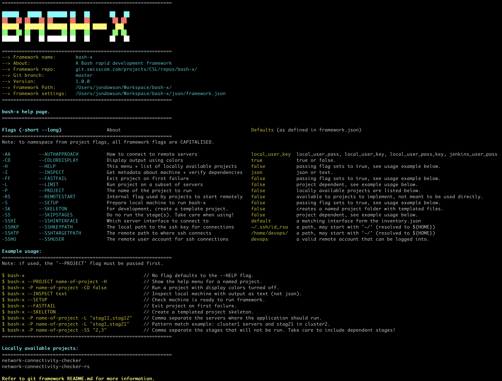
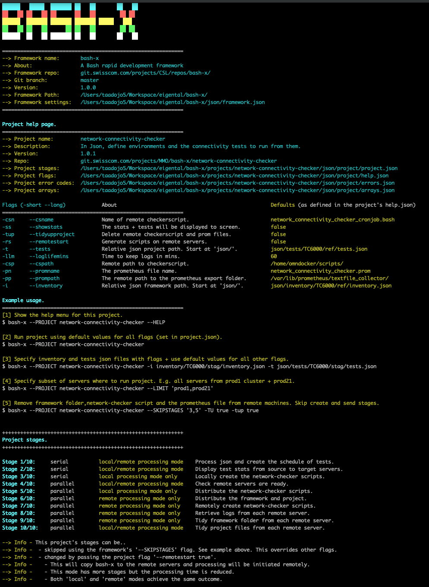

# Bash-x is a rapid-devops-framework.

***
<a name="M"></a>
# Menu:   

| 0   | [About](#AB)                       |                                                                                                                    |
|-----|------------------------------------|--------------------------------------------------------------------------------------------------------------------|
| 1   | [High Portability](#HP)            |                                                                                                                    |
| 2   | [Extensible Library](#EL)          |                                                                                                                    |
| 3   | [Data-driven programming](#DDP)    | [Framework](#DDPF) \| [Project](#DDPP)                                                                             |
| 4   | [Display / logging / errors](#DLE) |                                                                                                                    |
| 5   | [Concurrency](#CO)                 |                                                                                                                    |
| 6   | [Generic workflow](#GW)            |                                                                                                                    |
| 7   | [Getting started](#GS)             |                                                                                                                    |
| 8   | [Jenkins pipeline](#JP)            |                                                                                                                    |
| 9   | [Developing projects](#DP)         | [Structure](#DPS) \| [Skeleton](#DPS——) \| [Notation](#DPN) \| [Functions](#DPF) \| [Debug](#DPD) \| [Steps](#DPST) |
| 10  | [Roadmap](#R)                      |                                                                                                                    |

[Menu](#M) 
<a name="AB"></a>
## About   

***
{height=621 width=800}
***

Bash is a powerful scripting language found on nearly every computer (even Windows now!).     
Projects developed purely in bash are a convenient way for devops to side-step dependency issues and the need to install new software.   

However, bash scripting beyond simple tasks can be problematic and it is easy to introduce bugs when attempting bigger projects.  
It is not a high level programming language and lacks features that encourage a developer to go beyond tackling projects beyond a certain size.        
It lacks out-of-the-box features such as error handling / parallelism / logging and data-driven programming.                   

The **bash-x** framework addresses these short-falls and enables devops to rapidly create complex bash projects.   
- takes care of the "plumbing" and provides project developers ready to go functions that have been tested to work across different Linux flavors.    
- provides an easily manageable generic workflow with projects consisting of **stages** that contain **tasks**.      
- integrates the **jq** json parsing library so that meta data can be easily integrated into a project with no coding effort.       

Below is a summary of the principal features of the bash-x framework.

| # | Feature                               | Description                                                                                                                                 |
|---|---------------------------------------|---------------------------------------------------------------------------------------------------------------------------------------------|
| 1 | High portability.                     | Its just bash!                                                                                                                              |
|   |                                       | Well OK, there is also the bundled json processing jq library but this is itself a highly portable single file that may be copy and pasted. |
|   |                                       | Framework level dependencies are bash version > 4.3 (introduced 2014) and ubiquitous OS libraries such as grep, sed, awk.                   |
| 2 | Extensible library of bash functions. | For handling common bash duties such as string manipulation / handling arrays / network resolution / logging / displaying to screen etc     |
|   |                                       | Tested to work on the most popular flavors of linux (Mac, Debian and RHEL).                                                                 |
|   |                                       | Promotes code reuse with less time hunting bugs.                                                                                            |
| 3 | Data driven programming.              | A json parsing feature that means developers can author their own json structures.                                                          |
|   |                                       | The framework will automatically read these into filter friendly bash arrays and also convert to bash variables.                            |
|   |                                       | Project level dependencies are easily declared in json and auto-checked at runtime.                                                         |
| 4 | Concurrency                           | Track multiple processes in parallel and action on their completion status.                                                                 |
|   |                                       | Allow pipelines to finish much quicker than running many processes serially.                                                                |
| 5 | Display / logging / error-catching    | Ready to go display and logging capabilities.                                                                                               |
|   |                                       | As with the generic project workflow, this saves developer time and effort developing ancillary 'plumbing'.                                 |
|   |                                       | Error messages are caught and presented to the user / developer in a helpful manner.                                                        |
| 6 | Generic workflow for any project.     | Each project contains one or more stages, that consist of one or more tasks, that consist of one or more bash functions.                    |
|   |                                       | A stage can be run serially or in parallel (e.g. send file to multiple machines at the same time).                                          |
|   |                                       | This generic workflow allows complex projects to be easily modularized and stages can be recycled for other projects.                       |
|   |                                       | A subset of project stages can be run and as well delivered to a subset of remote servers.                                                  |
|   |                                       | Allows the developer to concentrate on the project objectives rather than trawling Stackoverflow for bash-how-to's 😉                       |             

***

[Menu](#M) 
<a name="HP"></a>
## High portability

The only requirements are a bash version greater than 4.3 (to support associative arrays and dynamic array creation) and the availability of ubiquitous OS libraries such as grep, sed, awk.       
As such the framework is highly portable with **no dependencies** to install.     
- Bash 4.3 was introduced in 2014 and bash 5.0 has been available since 2019.        
- Without dependencies, it does not require elevated system privileges to run.  
- On a Mac it does require Homebrew installed packages but such development machines will not have restrictions to prevent this.    
- On a Mac the --SETUP flag conveniently takes care of Homebrew dependencies.      
- The framework can be retrieved with git or copy and pasted between terminal windows (high portability!).                        
- The included **jq** libraries used for processing json are also copy and pastable between terminal windows.    
- The jq binaries are included for both X86 and ARM chipsets (e.g. Raspberry PI, New Macs).    
 
***

[Menu](#M) 
<a name="EL"></a>
## Extensible library of bash functions.

Tested on Mac, Ubuntu and Centos (RHEL) flavors of linux, these categorized library of functions save time and boost code reliability.     
The following subfolders are found at **bash-x/lib/functions/** and the functions contained within them are automatically invocable to any project.          

| Folder     | Function capability examples                              |
|------------|-----------------------------------------------------------|
| arrays     | manipulate, declare and display values held in arrays     |
| display    | color schemes, error messages and help screens            |
| errors     | error code handling                                       |
| framework  | initial function of framework - called by bash-x script |
| filefolder | operations on files and folders                           |
| json       | json conversion to arrays and variables                   |
| network    | calculate ip and curl to apis                             |
| os         | calculate OS and OS specific command handling             |
| ssh        | ssh and scp commands                                      |
| strings    | various string manipulation techniques                    |
| time       | script timers                                             | 


***

[Menu](#M) 
<a name="DDP"></a>
## Data driven programming

- Meta-data for projects is defined in flexible json.    
- The framework includes a recursive function that along with jq will process any well formed json.   
- This means that developers can easily define data in json and have it available in their project with no coding effort.          
- The json key-value pairs are automatically added to filter friendly arrays and converted into bash variables.    
- **framework.json** is where framework level meta data and default flag values are defined.           
- **project.json** is where each project defines its stage(s),task(s) and function(s).      
- **errors.json** is where each project's error handling messages are defined.      
- **help.json** is where each project's flags are defined and is used to auto generate the project help screen.
- **arrays.json** is where each project's arrays are defined.       
- Project developers can optionally author more json files and these too can be automatically ingested by the framework.  

Note:      
- to be successfully declared as a bash variable, the variable name must meet standard bash requirements.     
- i.e. must contain only letters, numbers and underscores and can only start with a letter or underscore.      
- keep this in mind when authoring json.    
- The function 'f_strings_bashVarFriendly' can be used to swap out certain commonly used chars with acceptable ones.    
- Use this function or create a project specific version to extend to other chars.     
         
[Menu](#M) 
<a name="DDPF"></a>
### Framework

The bash-x framework has the **framework.json** file for describing meta data and default settings for flags.

```json
{
    "framework":{
        "name":                "bash-x",
        "description":         "Framework for rapid development of any bash project",
        "version":             "1.0.0",
        "repo":                "git.swisscom.com/projects/MMO/repos/bash-x/",
        "flags":{
            "colordisplay":     "true"
        }
    }
}
```

```bash
# [1] The json key value pairs are added to the framework array 'A_variables_all'
# [2] The json key pair values are converted to bash variables using the function 'f_array_declare_all_variables'
#     - they are then available as bash variables.
#     - underscores are used to accommodate object nesting and so preserve uniqueness of variables.
#     - the variables are prepended with 'vj_' to denote their origin as a json file.
echo "${vj_framework_name}"                  # bash-x
echo "${vj_framework_description}"           # Framework for rapid development of any bash project
echo "${vj_framework_flags_display_color}"    # true
```

[Menu](#M) 
<a name="DDPP"></a>
### Project

Each project has a **json/project** folder containing 4 json files.        


```json

```    
```bash
# [1] The json key value pairs are added to the framework arrays 'A_variables_all' + 'A_project_vars'.
# [2] The json key pair values are converted to bash variables using the function 'f_array_declare_all_variables' + 'f_array_declare_project_variables'
#     - they are then available as bash variables.
#     - underscores are used to accommodate object nesting and so preserve uniqueness of variables.
#     - the variables are prepended with 'vj_' to denote their origin as a json file.
echo "${vj_project_name}"                    # network-connectivity-checker
echo "${vj_project_description}"             # Define in json connectivity tests and run them in specified environments.
echo "${vj_project_flags_loglifemins}"       # 60    
echo "${vj_project_flags_cronjob_enable}"    # true        
```

***

[Menu](#M) 
<a name="DLE"></a>
## Display / logging / error catching

***
{height=600 width=880}
***

- Framework functions for standardizing the display of information.     
- Simple color scheme to promote intuitive and clear output.     
- Logging to file and log rotation.    
- Zip-n-curl functions for posting logs to api endpoints.    
- Error stack traces and debug messages to speed up project development.    

For a detailed explanation of how error codes are setup, refer to [here](#DPD)    

***

[Menu](#M) 
<a name="CO"></a>
## Concurrency

A project comprises one or more stages, each containing one or more tasks.         
A stage can run as a single linear process (e.g. process local files in order).    
Or as many concurrent processes (e.g. send a file to multiple servers).        
- The framework has template functions to handle the creation and status tracking of all subsequent process ids (pids).    
- Pid success or failure is captured and this drives reactive logic and informative feedback.          
- Failed pids are collected in one array and successful ones in another.    

Note:    
- Determining the true state of a pid may require exterior checks, such as examining a log file or checking for the existence of an event.    
- Usually, however, the status of the pid is determined by its exit code - 0 for success and anything else for some kind of failure.      

***

[Menu](#M) 
<a name="GW"></a>
## Generic Workflow   

In addition to a library of standardized functions, the framework provides an out-of-the-box workflow.    
A **project** is split into **stages** which in turn are split into **tasks**.     
A **task** comprises one or more functions that themselves consist of bash commands.    
Stages, tasks and their functions are run in the order specified in the **project.json** file.    
The run order can be changed dynmamically and this is controlled in the project's **fp_project_custom_runorder** file.
This generic structure allows any complex application to be split into manageable chunks (stages).    
Stages are suited to be run either serially or as concurrent processes.     

Note:    
- The structure of each stage is arbitrary and chosen by the developer.     
- What influences this is:
  - What tasks naturally are grouped together.    
  - What tasks should be run serially or in parallel (a stage is either but not both).   
  - Whether the tasks are run ocally on remote machines.        
- For each stage, the progress of each task is tracked and status is captured.    
  - Projects can be set to exit on the first failure or continue.    
  - Meaningful error messages identify where the code failed enabling faster resolution of issues.   

Below is an example project split into 6 stages. There is a mixture of serial (1 and 6) and concurrent stages (2 to 5).    

| #Stage | Description of stage                           | Single or multiple processes | Where executed?                  |
|--------|------------------------------------------------|------------------------------|----------------------------------|
| 1      | compile local binaries and create a zip file   | single                       | local machine                    |
| 2      | send zip file to the remote servers            | multiple                     | initiated locally + run remotely |
| 3      | unpack zip file on each remote machine         | multiple                     | initiated locally + run remotely |
| 4      | manipulate config files on each remote machine | multiple                     | initiated locally + run remotely |
| 5      | start application on each remote machine       | multiple                     | initiated locally + run remotely |
| 6      | report the status of each stage and exit       | single                       | local machine                    |  


### Sequence of flow when running a bash-x project.  

This is the generic command to start a bash-x project.    
```bash
$ bash-x --PROJECT "my_project" --project_flagA "value" --project_flagB "value"
```

The only script is **bash-x** and all other bash code is held within functions.    
The table below shows the flow, as functions call other functions which inherit the scope of variables / arrays.   

|   | Function        | Description                                                                                                                                     |
|---|-----------------|-------------------------------------------------------------------------------------------------------------------------------------------------|
| 1 | bash-x        | The only bash script (all other code is within functions.) Load framework functions, create arrays and vars. Last function call is 'framework'. |
| 2 | framework       | Handle flags and perform checks. Load project functions and start project. Last function call is 'fp_project_start'.                                    |
| 3 | fp_project_start        | Initial project function that creates arrays, variables and runs checks. Last function call is 'f_stages_loop'.                                 |
| 4 | f_stages_loop   | Loop through all stages defined in project.json. For each stage run its functions in order. Handle concurrency.                                 |
| 5 | f_stages_functions_final | The last stage to be called. Summary of each stage and project exit messages.                                                          |

***

[Menu](#M) 
<a name="GS"></a>
## Getting started

### Local developer machine

#### Script installation

1. Clone this repository to your local machine.
1. Use the setup flag by running:
    ```bash
    $ ./bash-x --SETUP
    ```
1. Follow the instructions provided by the script at the end.

#### Manual installation

1. Clone this repository to your local machine.
1. Add the framework to the PATH so bash-x can be run from anywhere. Adapt and add these lines to your profile file (ex: ~/.bash_profile) and restart the terminal.        
    ```bash
    export BASHX_HOME=/Users/bob/bash-x/lib/
    export PATH=${BASHX_HOME}:$PATH
    ```
1. On macOS - there are some extra steps.   
    ```bash    
    # [1] Install homebrew
    $ /bin/bash -c "$(curl -fsSL https://raw.githubusercontent.com/Homebrew/install/HEAD/install.sh)" 
    
    # [2] Install brew packages
    $ brew install grep gawk gnu-sed coreutils jq sshpass         
    
    # [3] Ensure the path to brew is present in the PATH. Otherwise, add it to your profile file
    # Make sure to add the correct path based on your vf_architecture
    export PATH=/usr/local/bin:$PATH        # Intel vf_architecture
    OR
    export PATH=/opt/homebrew/bin:$PATH     # Apple Silicon vf_architecture
    ```

1. Restart the terminal.
1. Run the --HELP flag for the framework. You will see at the bottom a list of locally available projects. Then run the --HELP flag for a project.     
    ```bash
    $ bash-x --HELP
    $ bash-x --PROJECT "project-name" --HELP
    ```
1. Follow the instructions included in the help screen as well as the README located within the subfolder **projects/proj_name/**.    

Below is an example of a project help screen taken from the project **network-connectivity-checker**    

{height=1200 width=800}

***

[Menu](#M) 
<a name="JP"></a>
## Jenkins pipeline

The server running bash-x will need to be reachable from a Jenkins Master.   
The following example also requires docker installed as it executes bash-x within a container but this is an optional approach.     
To run a project in a Jenkins pipline, include at least one **Jenkinsfile** in the project root folder.      

- This file will then call **bash-x** with the required flags.    
- The Jenkins pipeline UI will display the options that become the flag parameters.     

In the following example Jenkinsfile:    
- The pipeline pulls a docker container from the artifact repository.    
- It then presents choices to the user in the Jenkins UI.    
- Credentials are retrieved from Jenkins and added to the environment.    
- The bash-x command line starts the application within the container.    

```bash
pipeline{
  agent { 
    docker{
      label 'smsc-ref'
      image 'smsc-bash-x:latest'
      registryUrl 'https://css-docker.artifactory.swisscom.com'
      registryCredentialsId 'artifactory-css'
      alwaysPull true
    }
  }
  environment {
    BITBUCKET_COMMON_CREDS = credentials('artifactory-css')
  }
  stages {
    stage('Select branch and environment to deploy'){
        steps {
            sh "rm -f branches.txt && git branch -r | sort -r > branches.txt"
            sh "sed -i '1s/^/bash-x\\/master\\n/' branches.txt"
            script{
                featurebranchlist = readFile 'branches.txt'
                timeout(time: 300, unit: 'SECONDS'){
                  deploymentparam = input message: 'Please choose the branch to deploy', ok: 'Ok',
                                      parameters: [ 
                                                    choice(choices: 'ref', description: '', name: 'env'),
                                                    choice(choices: "${featurebranchlist}", name: 'branch') 
                                                  ]
                }
                env.BRANCH = deploymentparam.branch.replaceAll(" ","");
            }
        }
    }
    stage("Make user selections"){
      steps{
        sh "pwd; ls -la";
        sh "git checkout -b + ${env.BRANCH}";
        sh "rm -rf inventory.txt && find inventory/TC6000/ref -type f -name '*.json' > inventory.txt";
        sh "rm -rf tests.txt && find projects/network-connectivity-checker/json/tests/TC6000/ref -type f -name '*.json' > tests.txt";
        script {
          inventoryList = readFile 'inventory.txt'
          testsList   = readFile 'tests.txt'
          timeout(time: 300, unit: 'SECONDS'){
            deploymentparam = input message: 'Pipeline options...', ok: 'Ok',
                                parameters: [ choice(choices: "${inventoryList}",description: 'Required: The inventory json file to use.', name: 'inventory'),
                                              choice(choices: "${testsList}",    description: 'Required: The tests json file to use.', name: 'tests'),
                                              choice(choices: ['false','true'],  description: 'Optional: Delete bash-x folder from remote VMs.', name: 'tidyup'),
                                              choice(choices: ['false','true'],  description: 'Optional: Delete checkerscript + prometheus files from remote VMs.', name: 'tidyupproject'),
                                              choice(choices: ['true', 'false'], description: 'Optional: Display output using colors.', name: 'colordisplay'),
                                              choice(choices: ['false','true'],  description: 'Optional: Display stats and tests (nice but takes longer).', name: 'showstats'),
                                              choice(choices: ['','--FASTFAIL'], description: 'Optional: Select flag to exit project on first failure.', name: 'fastfail') ,
                                              string(defaultValue: '', description: 'Optional: Limit with a comma separated string. E.g: for cluster1 and tcsmsc-21 only: \'tcsmsc-stag1,tcsmsc-stag21\'', name: 'limit'),
                                              string(defaultValue: '', description: 'Optional: Skip stages. For example, if removing framework and project files, only run stages 1,6 and 7. Skip: \'2,3,4,5\'', name: 'skipstages') ]
          }
          env.DEPLOY = 'ref';
          env.INVENTORY = deploymentparam.inventory;
          env.TESTS = deploymentparam.tests;
          env.TIDYUP = deploymentparam.tidyup;
          env.TIDYUPPROJECT = deploymentparam.tidyupproject;
          env.FASTFAIL = deploymentparam.fastfail;
          env.COLORDISPLAY = deploymentparam.colordisplay;
          env.SHOWSTATS = deploymentparam.showstats;
          env.LIMIT = deploymentparam.limit.replaceAll("[\\t\\n\\r]+",",");
          env.SKIPSTAGES = deploymentparam.skipstages.replaceAll("[\\t\\n\\r]+",",");

          if (env.LIMIT != '') {
            env.LIMIT = '--LIMIT '+ env.LIMIT
          }

          if (env.SKIPSTAGES != '') {
            env.SKIPSTAGES = '--SKIPSTAGES '+ env.SKIPSTAGES
          }

        }
        ansiColor('xterm'){
          echo "**********************************************************";
          echo 'Jenkins JOB_BASE_NAME: '+ env.JOB_BASE_NAME
          echo 'Jenkins JOB_NAME:      '+ env.JOB_NAME
          echo 'Environment:           '+ env.DEPLOY
          echo 'Git branch:            '+ env.BRANCH
          echo "**********************************************************";
          echo "Running the 'bash-x' bash framework:"
          echo 'Framework flags:'
          echo '--PROJECT              network-connectivity-checker'
          echo '--AUTHAPPROACH         jenkins_user_pass' 
          echo '--COLORDISPLAY         '+ env.COLORDISPLAY
          echo '--FASTFAIL             '+ env.FASTFAIL
          echo '--LIMIT                '+ env.LIMIT
          echo '--SKIPSTAGES           '+ env.SKIPSTAGES
          echo '--SSHINTERFACE         default' 
          echo '--SSHTARGETPATH        /home/service-user/' 
          echo '--SSHUSER              service-user' 
          echo 'Project flags:'
          echo '--inventory            '+ env.INVENTORY
          echo '--tests                '+ env.TESTS
          echo '--tidyup               '+ env.TIDYUP
          echo '--tidyupproject        '+ env.TIDYUPPROJECT
          echo '--showstats            '+ env.SHOWSTATS
          echo '--csname               network_connectivity_checker_cronjob.bash' 
          echo '--cspath               /home/service-user/scripts/'
          echo '--promname             network_connectivity_checker.prom'
          echo '--prompath             /var/lib/prometheus/textfile_collector/'  
          echo "**********************************************************";
        }
        script{
          timeout(time: 300, unit: 'SECONDS'){input message: 'OK to proceed?', ok: 'Ok'}
        }
        sh ("rm -rf inventory.txt tests.txt branches.txt")
        withCredentials([usernamePassword(credentialsId: "service-user-ref", passwordVariable: 'PASSWORD', usernameVariable: 'USERNAME')]) {
        sh("./lib/bash-x --PROJECT network-connectivity-checker \
        --COLORDISPLAY ${env.COLORDISPLAY} \    
        --AUTHAPPROACH jenkins_user_pass \
        --SSHUSER service-user \
        --SSHTARGETPATH /home/service-user/ \
        --SSHINTERFACE omn \
        ${env.LIMIT} \
        ${env.SKIPSTAGES} \
        ${env.FASTFAIL} \
        --inventory ${env.INVENTORY} \
        --tests ${env.TESTS} \
        --tidyup ${env.TIDYUP} \
        --tidyupproject ${env.TIDYUPPROJECT} \
        --showstats ${env.SHOWSTATS} \
        --csname network_connectivity_checker_cronjob.bash \
        --cspath /home/service-user/scripts/ \
        --promname network_connectivity_checker.prom \
        --prompath /var/lib/prometheus/textfile_collector/")
        }
      }
    }
  }
  post{
    always{
      cleanWs()
    }
  }
}
```  

***

[Menu](#M) 
<a name="DP"></a>
## Developing projects               

The raison d'être of the **bash-x** framework is to allow developers to easily create complex bash projects.    
But bash is a scripting language with no guard rails and it is very easy to write bad / dangerous / disorderly code and especially so when project complexity increases.       
To keep errors to a minimum and promote manageability, here are some best practices to follow.     

| #  | Best practice                     | Notes                                                                                                       |
|----|-----------------------------------|-------------------------------------------------------------------------------------------------------------|
| 1  | Design first                      | Be clear on project objectives from outset.                                                                 |
| 2  | Modularize                        | Use the stage / task model to deconstruct objectives into stages and then their constituent tasks.          |
| 3  | Comment code                      | Always add clear code commentary that others would understand.                                              |
| 4  | Define vars with helper functions | Declare project vars using the helper function as this assists debugging ([here](#DPD)).                    |
| 5  | Don't reassign variable values    | Create a new variable rather than reassign its value. Loop vars that change often should be declared local. |
| 6  | Use debug functions               | Use the debug functions to exhibit var values during development ([here](#DPD)).                            |
| 7  | Follow notation rules             | Use the notation rules for vars, arrays, functions to keep code manageable ([here](#DPN)).                  |
| 8  | Reuse where possible              | Check for existing function in framework library. Avoid function bloat.                                     |
| 9  | Test regularly                    | Test regularly as you code along. Finally test across target OS linux flavors.                              |
| 10 | Performance                       | Does your looping scale? is sed, awk, grep or bash expansion more efficient?                                |

***

[Menu](#M) 
<a name="DPS"></a>
### Structure    

Each project uses a standard folder structure and naming convention to promote speedier development and code reuse.    
The following table shows the standard folders.     

| #  | Folder/file                                                               | Description                                                                             |
|----|---------------------------------------------------------------------------|-----------------------------------------------------------------------------------------|
| 1  | bash-x/lib/functions                                                    | All these functions are available for use in any project.                               |
| 2  | bash-x/lib/templates                                                    | Templates meant to be copied and modified and put in project function folders.          |
| 3  | bash-x/projects/proj_name/lib/functions                                 | All project functions in categorized folders.                                           |
| 4  | bash-x/projects/proj_name/input_output/logs                             | Log files generated by project. Timestamped log(s) for each process.                    |
| 5  | bash-x/projects/proj_name/input_output/results                          | Any results files generated by project. Timestamped to distinguish.                     |
| 6  | bash-x/projects/proj_name/json/project/project.json                     | Where all stages, tasks and functions for project are defined.                          |
| 7  | bash-x/projects/proj_name/json/project/arrays.json                      | Where all arrays that are used in the project are defined.                              |
| 8  | bash-x/projects/proj_name/json/project/errors.json                      | Where all error messages that are used in the project are defined.                      |
| 9  | bash-x/projects/proj_name/json/project/help.json                        | The project help screen is generated from this and where project flags are defined.     |
| 10 | bash-x/projects/proj_name/lib/fp_project_start                                  | The initial project function file.                                                      |
| 11 | bash-x/projects/proj_name/lib/fp_stages/fp_stages_functions_alterations | This file allows program flow to be altered at runtime.                                 |
| 12 | bash-x/projects/proj_name/lib/fp_stages/fp_stages_remote                | This optional file is the initial file to be run on remote machines instead of fp_project_start.|
| 13 | readme_images                                                             | Any images used in README.md                                                            |
| 14 | README.md                                                                 | The README file.                                                                        |

Note:    
- Additional folders/subfolders can be added as the developer sees fit.    
- For example, any files required or generated by a project could be organized under the folder **/input_output/**     
- E.g. /input_output/results/, /input_output/software_inputs/ etc.   

***

[Menu](#M) 
<a name="DPS"></a>
### Project skeleton            

For developers, a template project can be generated using the **--SKELETON** flag.     
Each template file includes notes on usage.     

```bash
$ bash-x --SKELETON    
```

***

[Menu](#M) 
<a name="DPN"></a>
### Notation    

The table below shows the notation used when developing projects in order to clarify scope, avoid errors and make code more manageable.    
Framework variables, arrays and functions are name spaced from project ones so that clashes are always avoided.   
When naming use underscores and relevant words. See function section for example.    

| Notation                 | Description                                                                            | Scope    | Example                             | File if applicable                                          |
|--------------------------|----------------------------------------------------------------------------------------|----------|-------------------------------------|-------------------------------------------------------------|
| vj_framework_            | Framework metadata and flags.                                                          | global   | ${vj_framework_description}         | lib/json/framework.json                                     |
| vj_project_              | Project metadata. Also its stages, tasks and functions.                                | project  | ${vj_project_description}           | projects/proj_name/json/project.json                        |
| vj_help_                 | Project flags with default values + usage examples for auto made help page.            | project  | ${vj_help_flags_project_shortflag}  | projects/proj_name/json/help.json                           |
| vj_errors_               | Project error codes all defined in a single json file.                                 | project  | ${vj_errors_s0_e1_message}          | projects/proj_name/json/errors.json                         |
| A_                       | Framework associative-arrays with key value pairs.                                     | global   | ${A_framework_vars[@]}              |                                                             |
| a_                       | Framework arrays with values indexed at an integer position.                           | global   | ${a_variables_all_ordered[@]}       |                                                             |
| vf_                       | Framework variables defined in framework functions.                                    | global   | ${vf_os_identify}                    |                                                             |
| vp_                      | Project variables defined in project functions.                                        | project  | ${vp_stageid}                       |                                                             |
| local                    | Variables defined in functions with local scope only (local is a bash keyword).        | function | local flag;                         |                                                             |
| f_                       | Framework functions available to any bash project to utilize.                          | global   | f_utils_strings "count_chars" "cat" |                                                             |
| fp_                      | Project functions available to a given project.                                        | project  | fp_debug_arrays                     |                                                             |
| fp_project_start                 | Project function that is always the initial function.                                  | project  | fp_project_start                            |                                                             |
| fp_S0                    | Project function for stage 0. This stage is for project setup and checks.              | project  | fp_S0_dothis                        | /projects /proj_name/lib/functions/fp_S0                    |
| fp_S1                    | Project function for stage 1. This is the first project stage of x number.             | project  | fp_S1_dothat                        | /projects /proj_name/lib/functions/fp_S1                    |
| fp_multipids             | Project functions for managing subprocesses.Create, wait, display (fail,pass,details). | project  | fp_multipids_create                 | /projects /proj_name/lib/functions/fp_multipids             |
| fp_stages_alterations    | Project function for changing program flow based on flags and other conditions.        | project  | fp_stages_alterations               | /projects /proj_name/lib/functions/fp_stages_alterations    |

***

[Menu](#M) 
<a name="DPF"></a>
### Functions    
    
There are three types of functions that any project will use.    

1. Bespoke. 
1. Framework.   
1. Skeleton templates.    
   
- Bespoke functions are created fresh by the developer and are specific to a project.       
- Framework functions are the ready-to-use functions provided by bash-x and are called directly within the project code.     
- Template functions are generated using the --SKELETON flag and adjusted easily for a specific project's needs.     

Functions that are bespoke or come from a template are put in one of the categorized folders under **/bash-x/projects/proj_name/lib/functions/**.    
The naming of the function is important to promote code management and its name should reflect what it does and which sub folder it is put in.   
For example, a function that creates a 'test' array could be named **fp_S1_array_create_tests** and should live in a subfolder names **array**.    
- 'fp_' - namespaces this as a project, rather than a framework function.    
- 'S1_' - this function is used in stage 1. This label reflects the first usage of the function and does not limit its usage to one stage.      
- 'array_' - part signifies that this function is related to arrays and this follows the name of the folder.     
- 'create_tests' - specifies what this function does with a verb followed by the name of the array.        

Following these conventions will make debugging and coding in general much easier for the developer.

***

[Menu](#M) 
<a name="DPD"></a>
### Debug   
   
For debugging purposes, use the bash-x framework helper function to assign values to variables.    
This adds the variable and its value to an array as well as declaring it as a bash variable.     
For the developer, at any point in the code, they can then use the framework's debug function to display all variables and their values.              
If this practice is followed, it is then easy to catch bad value assignments.    

```bash 
# This helper function creates a bash variable and as well adds it to the array of all variables.        
f_arrays_set_var "vf_local_hostname"  "$(hostname -f)"; 

# Ready to use as bash variable on next line.
echo ${vf_local_hostname};

# So avoid this direct bash variable assignment using standard bash syntax!!
vf_local_hostname="$(hostname -f)";

# At any point in project code we can dump out the values of all variables to debug.    
# For example, here we can print out all variables and filter on those originating in the project help.json. 
f_debug_arrays "all" "vj_help";

```

***

[Menu](#M) 
<a name="DPST"></a>
### Steps  


***

[Menu](#M) 
<a name="R"></a>
## Roadmap  

| # | Feature                             | Description                                                                               |
|----|------------------------------------|-------------------------------------------------------------------------------------------|
|  1 | ~~Basic dependency checker~~       | ~~check framework and project dependencies are met~~                                      |
|  2 | ~~Setup flag~~                     | ~~flag to setup framework on all OS~~                                                     |
|  3 | ~~Migrate arrays to json~~         | ~~developers to declare in json rather than arrays (help menu, rules and checks etc)~~    |
|  4 | ~~Skeleton project flag~~          | ~~genreate new project from a template~~                                                  |
|  5 | Migrate project flags to framework | finish for projects and framework.                                                        |
|  6 | Add framework command runner       | run any command over 1..n machines.                                                       |
|  7 | Complete dependency checker        | finish for projects and framework.                                                        |
|  8 | Complete inspector                 | add all checks to the inspector.                                                          |
|  9 | Segregate framework and projects   | public repo for framework and private for projects.                                       |
| 10 | Project install flag               | flag to retrieve and setup projects                                                       |
| 11 | Minimizer                          | script to minimize framework and projects                                                 |
| 12 | Versioning with sha256             | version check framework and projects                                                      |

# How to compile jq

1. Download the source from this link and uncompress it: https://stedolan.github.io/jq/download/

2. Install GCC and Make: sudo apt install build-essential

3. Install Automake: sudo apt install automake

4. sudo apt install libtool

5. Inside the just uncompressed directory, run: ./configure && make
    
    * If you encounter any error, run the following command and then retry step 5.: autoreconf -fi


Source:

https://stedolan.github.io/jq/download/

https://blog.cpming.top/p/warning-macro-amproglibtool-not-found

https://www.levelupwasm.com/sample-jq.pdf

https://github.com/stedolan/jq